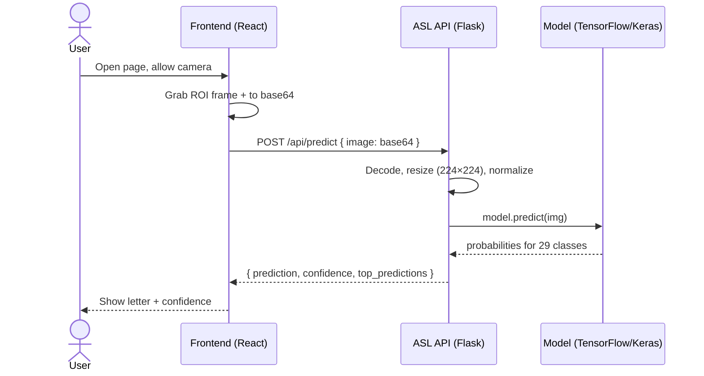
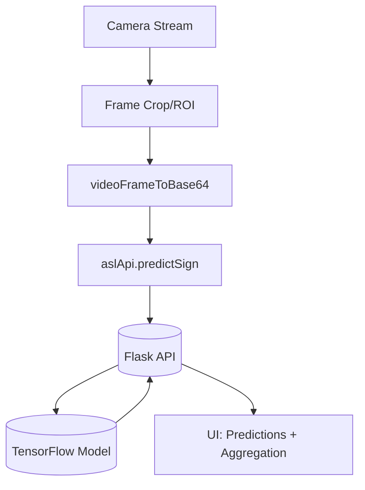

# Sign Language Recognition Platform

A full-stack American Sign Language (ASL) recognition platform combining a Python deep‑learning API with a modern React + Vite frontend. The app captures frames from the user’s camera, sends them to a TensorFlow/Keras model, and returns predicted ASL characters along with confidences.

## Repository layout

```
sign-lang/
├─ asl-node-api/                  # Node + Express backend (auth, users, logs, stats)
│  ├─ src/index.js                # Server entry (Express + SQLite)
│  ├─ src/db.js                   # DB init (better-sqlite3)
│  ├─ src/auth.js                 # JWT middleware
│  ├─ package.json                # Start script and deps
│  └─ .env.example                # PORT/JWT/PREDICTOR_URL/DB config
├─ asl-recognition-api/           # Python Flask predictor (optional ML service)
│  ├─ app.py                      # REST endpoints (health, predict, batch, labels)
│  ├─ inf.py                      # Standalone webcam demo (OpenCV)
│  ├─ asl_mobilenetv2.h5          # Trained MobileNetV2 model (A–Z + special)
│  ├─ requirements.txt            # Python dependencies
│  └─ asl_env/                    # (Optional) local virtual environment
└─ gesture-bridge-hub/            # Frontend (Vite + React + TypeScript)
  ├─ package.json                # Scripts and dependencies
  ├─ vite.config.ts              # Dev server (default: http://localhost:8080)
  └─ src/
    ├─ lib/aslApi.ts            # API client + frame-to-base64 helper
    ├─ pages/                   # Pages (Dashboard, Home, Translate, etc.)
    └─ components/              # UI and feature components
```

## Tech stack

- Frontend
  - React 18, TypeScript, Vite 5
  - Tailwind CSS, shadcn/ui, Radix UI primitives
  - React Router, TanStack Query
  - Recharts, three.js (3D), lucide-react icons

- Backend
  - Python (3.11+ recommended)
  - Flask 3, flask-cors
  - TensorFlow 2.x, Keras 3, NumPy, OpenCV

## How it works (high level)

1) The frontend accesses the user’s camera and crops a region of interest (ROI) for the hand.
2) Each frame is converted to base64 using `videoFrameToBase64` (see `src/lib/aslApi.ts`).
3) The image (base64) is POSTed to the API `/api/predict`.
4) The API decodes the image, resizes to 224×224, normalizes, and runs inference with the MobileNetV2 model.
5) The API returns the top prediction plus confidences, which the frontend displays and may aggregate into words/sentences.

### Sequence flow



### Component architecture



## Backend (Node/Express)

Key files:

- `asl-node-api/src/index.js` — Express server with JWT auth, user management, logs, and stats
- `asl-node-api/src/db.js` — SQLite schema and setup (better-sqlite3)
- `asl-node-api/.env.example` — configure `PORT`, `JWT_SECRET`, `PREDICTOR_URL`, and `DATABASE_FILE`

This Node server can forward prediction requests to a separate predictor service (see Python section below), log results, and serve dashboards/stats APIs.

### Run locally (Windows PowerShell)

```powershell
cd .\asl-node-api
Copy-Item .env.example .env

# Edit .env and set at least JWT_SECRET; optionally set PREDICTOR_URL
npm install
npm start
```

The server runs at `http://localhost:5000` by default.

## Backend (Python predictor, optional)

Key files:

- `app.py` — Flask server exposing REST endpoints with CORS enabled
- `asl_mobilenetv2.h5` — trained MobileNetV2 model (29 classes: A–Z, space, del, nothing)
- `inf.py` — optional standalone OpenCV demo using your webcam

### Endpoints

- `GET /health` — API health and whether the model loaded successfully
- `POST /api/predict` — Predict one image
  - Body: `{ "image": "<base64>" }`
  - Response: `{ success, prediction, confidence, top_predictions }`
- `POST /api/predict-batch` — Predict many images
  - Body: `{ "images": ["<base64>", ...] }`
  - Response: `{ success, results: [{ prediction, confidence, error? }] }`
- `GET /api/labels` — List of model labels

### Run locally (Windows PowerShell)

```powershell
# 1) Create and activate a virtual environment
cd .\asl-recognition-api
python -m venv .venv
.\.venv\Scripts\Activate.ps1

# 2) Install dependencies
pip install -r requirements.txt

# 3) Start the predictor (e.g., change port to 5001 if Node is on 5000)
python .\app.py
```

Notes
- The server logs “Model loaded successfully” if `asl_mobilenetv2.h5` is present and compatible.
- OpenCV is not required for API prediction (only for the `inf.py` webcam demo).

## Frontend (gesture-bridge-hub)

Key files:

- `src/lib/aslApi.ts` — API client and `videoFrameToBase64` helper
- `src/pages/` — page-level routes such as `TranslatePage`, `PoseSearchPage`, `LessonDetailPage`, etc.
- `vite.config.ts` — dev server bound to `http://localhost:8080`

### Configure and run

```powershell
cd ..\gesture-bridge-hub

# 1) Install dependencies
npm install

# 2) Configure API base URL
"VITE_API_URL=http://localhost:5000" | Out-File -FilePath .env.local -Encoding utf8

# 3) Start the dev server (http://localhost:8080)
npm run dev
```

If the window doesn’t open automatically, visit `http://localhost:8080` in a browser.

## Application features

- Real-time ASL letter prediction (A–Z) with confidences
- Special tokens: `space`, `del`, `nothing`
- Top‑N predictions to aid UI hints or fallback behavior
- CORS-enabled API for seamless local development

Potential/observed pages (may vary slightly by build):
- Home, Dashboard, Translate, Pose Search, Lesson Detail, Login/Signup

## Data model and labels

- Input: RGB image (base64), resized to 224×224, normalized to [0,1]
- Output: 29-way softmax probabilities
- Labels: A–Z plus `space`, `del`, `nothing`

## Environment variables

- Frontend
  - `VITE_API_URL` — Base URL for the API (default: `http://localhost:5000`)

- Node backend (asl-node-api/.env)
  - `PORT` — Node API port (default `5000`)
  - `JWT_SECRET` — secret for signing JWT access tokens
  - `PREDICTOR_URL` — Base URL for the predictor microservice (optional, e.g., `http://localhost:5001`)
  - `DATABASE_FILE` — SQLite file path (default `./data/asl.db`)

## Local development workflow

1) Start the API
   - Terminal A: `cd asl-recognition-api; python -m venv .venv; .\.venv\Scripts\Activate.ps1; pip install -r requirements.txt; python .\app.py`
2) Start the frontend
   - Terminal B: `cd gesture-bridge-hub; npm install; echo VITE_API_URL=http://localhost:5000 > .env.local; npm run dev`
3) Open `http://localhost:8080`, allow camera access, and navigate to the translation/recognition page.

## Testing the API quickly

PowerShell example (assumes you have a test image at `C:\temp\hand.jpg`):

```powershell
$bytes = [System.IO.File]::ReadAllBytes("C:\\temp\\hand.jpg")
$b64 = [System.Convert]::ToBase64String($bytes)
Invoke-RestMethod -Method Post -Uri "http://localhost:5000/api/predict" -ContentType "application/json" -Body (@{ image = $b64 } | ConvertTo-Json)
```

## Troubleshooting

- Frontend dev server fails to start
  - Ensure Node.js 18+ is installed: `node -v`
  - Clear lockfiles and reinstall: delete `node_modules` and `bun.lockb` (if unused), then `npm install`
  - Port 8080 in use: change `vite.config.ts` or stop the conflicting process

- API can’t load the model
  - Verify `asl_mobilenetv2.h5` exists in `asl-recognition-api/`
  - Ensure your Python + TensorFlow build are compatible (a clean venv is recommended)

- CORS or connection issues
  - Confirm `VITE_API_URL` matches the API origin (default `http://localhost:5000`)
  - Check browser console/network tab for request/response details

- OpenCV or camera errors (for `inf.py` only)
  - Make sure a camera is connected and accessible; close other apps using the webcam

## Production notes

- Restrict CORS in `app.py` to trusted origins
- Consider packaging the API via Docker and serving the frontend as static assets behind a reverse proxy
- Add authentication/authorization if exposing the API publicly

## Roadmap ideas

- Word-level smoothing and grammar-aware decoding
- Model upgrades (quantization, on‑device inference, or WebNN/WebGPU)
- Accessibility improvements and offline support
- Test suite for API and UI components

---

Made with Flask + TensorFlow on the backend and Vite + React on the frontend.
